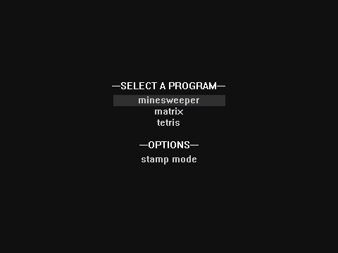

JBlocks
=======
Yet another Scratch runtime, this time in Java.

Build with maven. Compiles a standalone jar.

- mvn package
- java -jar target/jblocks-0.0.1-jar-with-dependencies.jar <project.json>

Preview showing off performance on [DCPU-16's](https://scratch.mit.edu/users/DCPU-16/) [DCPU-16 emulator](https://scratch.mit.edu/projects/11693479/).

